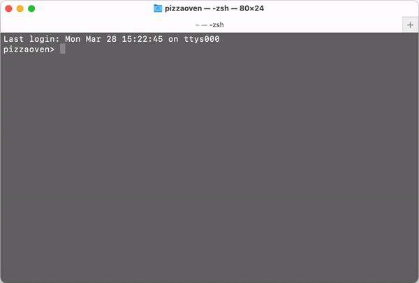

# mensa.js

*mensa.js* is a ready-to-use node.js script which crawls the website of the Bern University of Applied Sciences in order to retrieve today's cantina menu in Biel.

## Requirements

- Node.js (v8+)
- *v10.15.1 is recommended*

## Installation

First, open your terminal or git bash in order to clone and install this repository into any directory of your choice:
```
git clone https://github.com/frickerg/mensajs.git
cd mensajs
npm install
```

## Add mensa.js to your terminal

Now this is where the fun begins: Imagine to sit in a lecture and your stomach is growling like crazy. It would be way too distracting from this precious lecture if we had to open up the bfh website and search for the menu.

Since we're programmers, we do everything (or most things) inside a terminal. We will eventually be able to check today's menu with only one simple command!

### On Linux
Since you use Linux, I assume that you know what you are doing.
Create an alias for the node command in your `.bash_profile`, `.bashrc`, `.zshrc` or other startup scripts:

```bash
alias mensajs='node ~/path/to/mensajs/mensa.js'
```

Changes are only available in a new shell session. To make changes immediately
available, run `source ~/.bashrc` (or your shell config file like `.zshrc`).

The best way however in my opinion, is to always restart your computer after messing with your bash 😉

### On Mac OS
On Mac OS, open Finder and navigate to your home directory (named after your username with the house-icon) and show all hidden files with `CMD + SHIFT + .`

You will now see a file called `.bash_profile`, open it with a TextEditor of your choice and add your aliases at the end of the file:

```bash
alias mensajs='node ~/path/to/mensajs/mensa.js'
alias mensa='mensajs'

# You can use whatever you want as an alias, like for very hungry days:
alias givemefood='node ~/path/to/mensajs/mensa.js'
```

To make the command available from everywhere in the system, **DO NOT** remove the ~/ prefix at the beginning!

Save the file and close it. Now log out or restart your computer.
You can now retrieve today's cantina menu by simply entering the command `mensajs` (or any other alias defined by yourself) and the script will display today's menu inside of your terminal! 🎉

### On Windows

Create a .bat or .cmd file with DOSKEY commands. Be sure to save the file on your `C:\` drive and avoid any `User` sub-directories such as `Desktop`, `Documents`, etc. (I usually save it as close to the `C:\` root directory as possible or directly inside my own `User` directory).

Now write this into your newly created file and adapt the path:
```cmd
@echo off

DOSKEY mensajs="node C:\path\to\mensajs\mensa.js"
DOSKEY mensa="mensajs"
```

Run `regedit` and go to `HKEY_CURRENT_USER\Software\Microsoft\Command Processor`, then choose `Add String Value` to add a new entry with the name `AutoRun` and the **full** path of your `.bat/.cmd` file.

For example, `%USERPROFILE%\alias.cmd`, replacing the initial segment of the path with `%USERPROFILE%` is useful for syncing among multiple machines. This way, every time cmd is run, the aliases are loaded. The path as well as the name of your `.bat/.cmd` file are completely up to you and within your own responsibility.

After performing all these steps, make sure to restart your computer. The aliases should now be set and you can call the script with the alias you've set within your `.bat/.cmd` file.
 
## Run it!

After successfully performing all required steps described above, just open a terminal of your choice, type your specified alias command and press enter to get the glorious mensa menu of today!



## Arguments

### Language
You can specify in which language you want to retrieve the menu. Default is German.
To retrieve the menu in French, add the `--fr` argument:
```bash
node mensa.js --fr'
```

### Week
You can retrieve the menu of the whole week.
To retrieve the menu of the week, add the `--week` argument:
```bash
node mensa.js --week'
```

*Copyright (c) 2022 Guillaume Fricker*

## Contributors Hall of Fame

**Gabriel Hess (@hessg1):**
- Fixed a breaking error after the layout of the website had changed
- Implemented the "Mardi Francophone", an important tradition at the I4MI

**Joshua Drewlow (@drewjosh):**
- Fixed fetching data from new website layout
- Show date on menu entry
- Added argument to retrieve week menu
